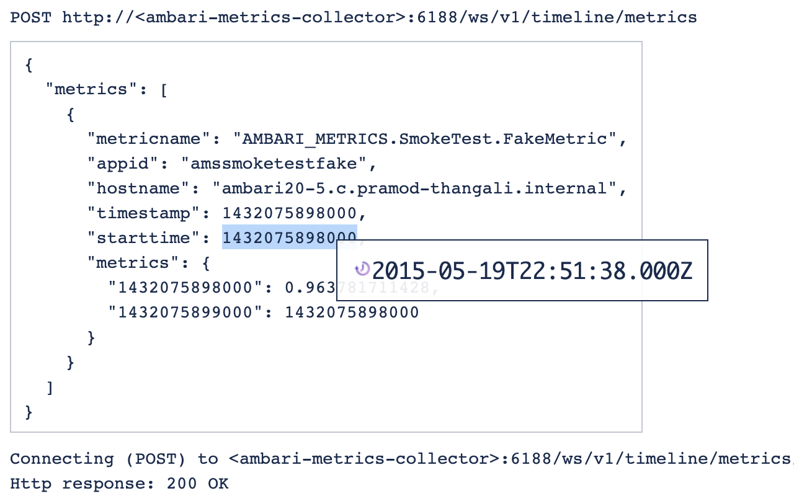

# Timestamp Converter GMT
  

### Chrome Extension to convert Epoch timestamps to GMT ISO format.

This is a fork of https://github.com/prajwalrao/ts-converter .

****
### Differences in this Fork

#### GMT and ISO

The original utility invariably uses the browser local time zone. For my backend work, where all (well, most) time information is stored in (milli-)seconds-since-epoch **GMT**, showing the decoded data in **GMT** makes more sense. Also, I prefer the ISO format, which is readily supported in JavaScript as well, so let's use that.

Example: The original extension shows for epoch timestamp 1432075898000 the tooltip as "Tue May 19 2015 15:51:38 GMT-0700 (PDT)". With this variant of the extension installed, the same number shows up as "2015-05-19T22:51:38.000Z". Of course, it is the very same point in time, just expressed in a different time zone: GMT instead of PDT, and in ISO 8601 format.

#### Selectable Tooltip

Also, the "tooltip" content can now be marked with the mouse, then copied to the clipboard. In the original, the tooltip closes on each mouse down, making getting to the decoded timestamp unduly hard.

****
### Install

Install the [Chrome Extension from here](https://chrome.google.com/webstore/detail/timestamp-converter/hmneiieiipdcnffddenpfdbocjndjlni)

### Some Timestamps to try out

**Highlight** (double click) any timestamp and you will see the corresponding UTC ISO 8601 timestamp as a tooltip.

| Epoch Timestamp | UTC ISO 8601 Timestamp   |
| --------------- | ------------------------ |
| 1461086790000   | 2016-04-19T17:26:30.000Z |         
| 1461086790      | 2016-04-19T17:26:30.000Z |
| 1482652799      | 2016-12-25T07:59:59.000Z |
| 1482479999      | 2016-12-23T07:59:59.000Z |
| 1463986801      | 2016-05-23T07:00:01.000Z |
| 1603919289342   | 2020-10-28T21:08:09.342Z |

### Screenshot

